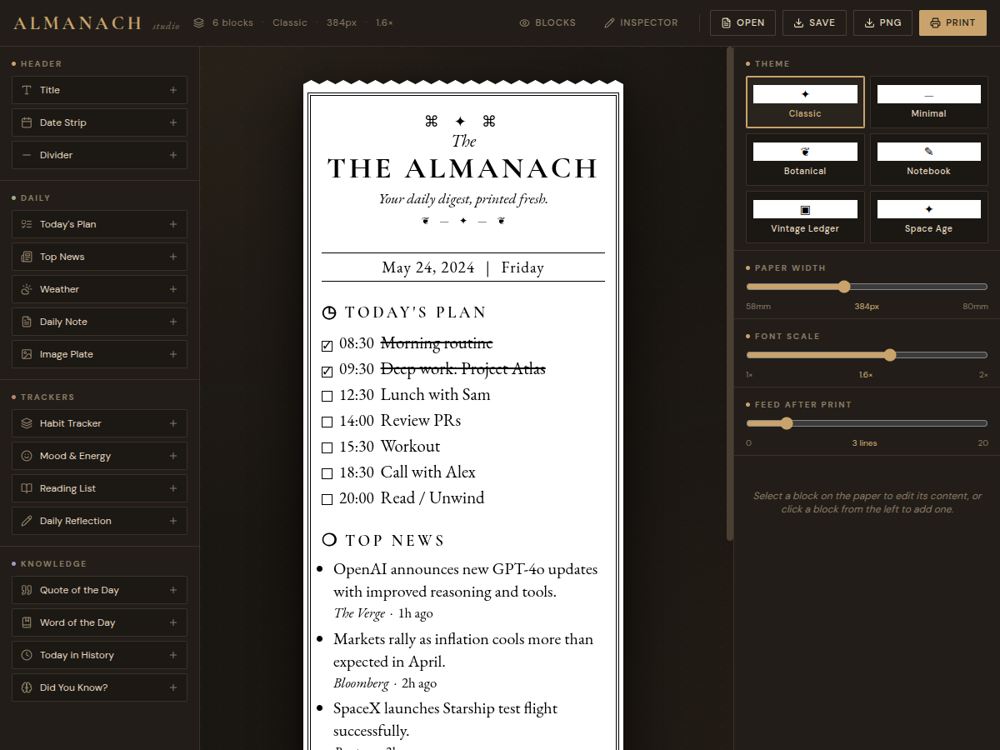
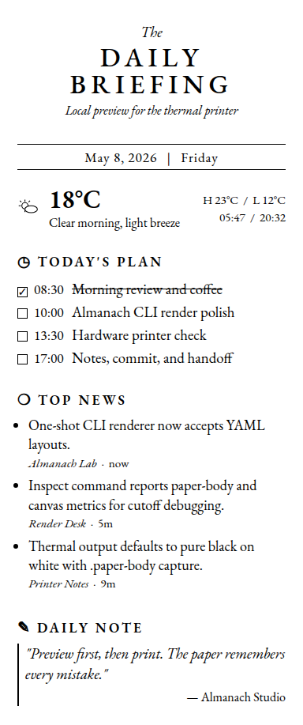
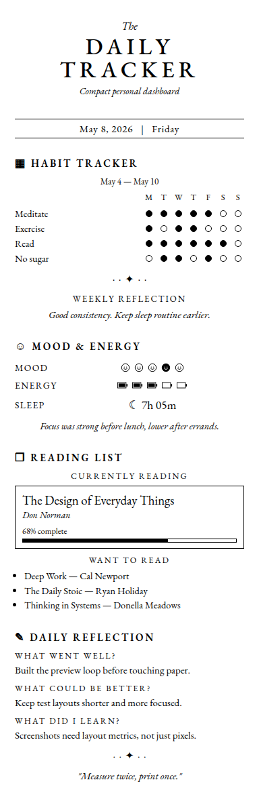
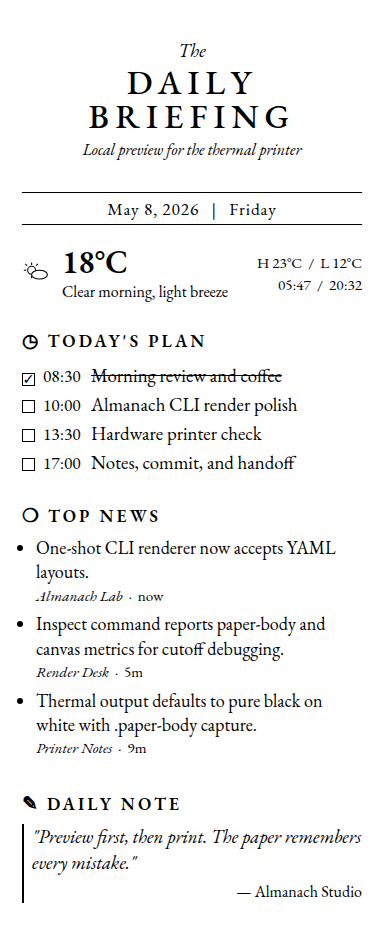

# 🖨️ Almanach — Thermal Printer Studio

Almanach is a self-hosted tool for designing, rendering, and printing pages on 58mm thermal paper. It pairs a React-based layout editor (Almanach Studio) with a Go rendering service that uses Chrome headless to produce pixel-perfect 1-bit bitmaps, then sends them to an ESP32-powered thermal printer.

## What's in the Box

```
almanach/
├── cmd/almanach-render-service/  ← Go binary entrypoint
├── internal/app/                 ← CLI verbs, HTTP API, Chrome renderer, bitmap packing, printer client
├── internal/app/doc/             ← Embedded help pages (layout DSL reference, tutorials)
├── internal/web/                 ← go:embed target for bundled SPA assets
├── web/                          ← Almanach Studio React SPA source
│   └── src/almanach-studio.jsx   ← Layout engine, block renderers, themes, image upload
│   └── src/fonts-embedded.css   ← Google Fonts woff2 (base64) — no network needed at runtime
├── firmware/atoms3r/             ← ESP-IDF firmware for M5Stack AtomS3R Lite printer endpoint
├── examples/
│   ├── layouts/                  ← Sample YAML layouts (9 examples)
│   ├── rendered/                 ← Pre-rendered PNG previews with inspect metadata
│   └── bundles/                  ← ZIP bundles with layout + image assets
└── Dockerfile                    ← Single-container image: Go binary + Chrome headless-shell
```

## How It Works

```
┌─────────────┐    ┌──────────────┐    ┌───────────┐    ┌─────────────┐
│  YAML/JSON   │───▶│  Go Server   │───▶│  Chrome   │───▶│  1-bit       │
│  Layout      │    │  (serve)     │    │  Headless  │    │  Bitmap      │
└─────────────┘    └──────┬───────┘    └───────────┘    └──────┬──────┘
                          │                                     │
                   ┌──────▼───────┐                      ┌──────▼──────┐
                   │  Studio SPA  │                      │  ESP32      │
                   │  (React UI)  │                      │  Printer    │
                   └──────────────┘                      └─────────────┘
```

1. **You write a layout** in YAML (or JSON) — a list of blocks like `title`, `weather`, `quote`, `image`.
2. **The Go server** navigates Chrome to the Studio SPA, injects your layout JSON, waits for fonts/images to load, and screenshots the paper element.
3. **The screenshot** is converted to a packed 1-bit bitmap (384px wide = 48 bytes/row).
4. **The bitmap** is sent to the ESP32 printer firmware via HTTP POST (`/api/print/bitmap`).
5. **The ESP32** streams the bitmap to the K118 thermal mechanism over UART.

## Quick Start

### Build

```bash
# Build web assets and bundle into Go binary
make build
# — or manually:
CGO_ENABLED=1 go build -tags=embed -o dist/almanach-render-service ./cmd/almanach-render-service
```

> **CGO_ENABLED=1 is required** — go-sqlite3 (indirect dep via glazed) needs CGO. The repo's Dockerfile originally used `CGO_ENABLED=0` which crashes at startup.

### Print a layout

```bash
almanach-render-service print \
  --layout examples/layouts/02-daily-briefing.yaml \
  --printer-ip 192.168.0.126 \
  --feed-lines 3 \
  --output yaml
```

### Preview without printing

```bash
almanach-render-service render \
  --layout examples/layouts/02-daily-briefing.yaml \
  --out /tmp/preview.png
```

### Start the web UI

```bash
almanach-render-service serve --port 8199
# Open http://localhost:8199/almanach
```



## CLI Commands

| Command | Description |
|---------|-------------|
| `serve` | Start the HTTP API server + Studio web UI |
| `render` | Render a layout once → PNG or raw bitmap |
| `inspect` | Render + emit DOM metrics (for debugging cutoffs) |
| `print` | Render + send bitmap to the ESP32 printer |
| `ble-provision` | Pair the printer over BLE (native Go or Web Bluetooth) |
| `setup` | Start the setup wizard for first-time BLE pairing |

## HTTP API

| Endpoint | Method | Description |
|----------|--------|-------------|
| `GET /health` | GET | Health check (printer IP, version) |
| `GET /almanach` | GET | Almanach Studio SPA |
| `GET /almanach/bundle.js` | GET | React bundle |
| `GET /almanach/fonts.css` | GET | Embedded Google Fonts (base64 woff2) |
| `POST /api/render` | POST | Render a layout → PNG or bitmap |
| `POST /api/render-and-print` | POST | Render + send to printer |
| `GET /setup` | GET | BLE pairing wizard |

### Print via HTTP

```bash
# Convert YAML → JSON and POST
cat layout.yaml | python3 -c "import sys,yaml,json; print(json.dumps(yaml.safe_load(sys.stdin)))" | \
  curl -X POST http://localhost:8199/api/render-and-print \
    -H "Content-Type: application/json" \
    -d @-
```

## Layout Format

Layouts are YAML or JSON objects describing a thermal paper page as an ordered list of blocks:

```yaml
almanach_studio_version: 1
theme: minimal
paperWidth: 384
bodyScale: 1.3
feedLines: 3
blocks:
  - id: title-1
    type: title
    data:
      text: DAILY BRIEFING
      subtitle: Thursday, May 14, 2026
  - id: date-1
    type: date
    data:
      date: May 14, 2026
      day: Thursday
  - id: weather-1
    type: weather
    data:
      temp: 18°C
      condition: Clear morning
      high: 23°C
      low: 12°C
  - id: quote-1
    type: quote
    data:
      text: Simplicity is prerequisite for reliability.
      author: Dijkstra
```

### Block Types

| Type | Description |
|------|-------------|
| `title` | Page heading with subtitle |
| `date` | Date line under the title |
| `divider` | Visual separator (`line`, `dots`, `wave`, `leaves`) |
| `weather` | Compact current conditions |
| `plan` | Time-ordered checklist (with done/undone) |
| `news` | Short headlines |
| `note` | Italic callout |
| `quote` | Centered quotation |
| `word` | Vocabulary/word-of-the-day |
| `history` | Dated historical facts |
| `did` | Fun facts list |
| `habits` | Weekly habit tracker grid |
| `mood` | Daily mood/energy/sleep tracker |
| `reading` | Current book + reading queue |
| `reflection` | Daily journal footer |
| `image` | Embedded photo or illustration |

See `almanach-render-service help layout-dsl-reference` for the complete field reference.

### Themes

| Theme | Style |
|-------|-------|
| `classic` | Double-line ornate frame, serif fonts |
| `minimal` | Clean, no frame, DM Sans + EB Garamond |
| `botanical` | ❦ corner decorations, serif fonts |
| `notebook` | Lined paper, handwriting fonts |
| `ledger` | Vintage ledger, boxed sections |
| `space` | ✦ star decorations, sans-serif |

### Images

Use the `image` block to embed photos or illustrations. For headless/CLI rendering, embed as data URLs so no network fetch is needed:

```yaml
- id: img-1
  type: image
  data:
    label: Fox
    src: data:image/png;base64,iVBOR...
    alt: A fox engraving
    caption: Vintage illustration
    height: 100
    fit: cover
    border: true
    grayscale: true
```

To convert a local image:

```bash
python3 -c "import base64,sys; print('data:image/png;base64,' + base64.b64encode(open(sys.argv[1],'rb').read()).decode())" image.png
```

## Example Renders

### Minimal


### Daily Briefing


### Knowledge Strip


### Tracker Journal


### Image Block


### Paper Shell Preview (with zigzag edges)


## Printing Architecture

### Segmented Printing

The ESP32 httpd cannot reliably receive >~38 KiB in a single HTTP request. Bitmaps exceeding this limit are **automatically split into horizontal segments** and sent as sequential POSTs. Only the last segment includes the paper feed. This is handled transparently — no action needed from the user.

```
Large bitmap (111 KiB)
    ├── Segment 1 (36 KiB) → POST /api/print/bitmap (X-Feed: 0)
    ├── Segment 2 (36 KiB) → POST /api/print/bitmap (X-Feed: 0)
    ├── Segment 3 (36 KiB) → POST /api/print/bitmap (X-Feed: 0)
    └── Segment 4 ( 3 KiB) → POST /api/print/bitmap (X-Feed: 3)
```

### Paper Feed

Feed is implemented as **baked blank raster rows** appended to the bitmap body. The firmware also receives an `X-Feed` header as a supplementary signal (issues `ESC d n`), but the primary feed mechanism is the blank rows since `ESC d n` alone is not visually reliable on the K118 mechanism.

3 feed lines × 24 pixels/line = 72 blank rows ≈ 3.4 KiB at 384px width.

### ESP32 Printer API

```
POST http://<PRINTER_IP>/api/print/bitmap
Headers:
  X-Width: 384
  X-Height: <height>
  X-Feed: <feedLines>
  Content-Type: application/octet-stream
Body: packed 1-bit bitmap (MSB first, 48 bytes/row at 384px)
```

## Docker Deployment

### Build & Run

```bash
docker build -t almanach-render-service .
docker run -p 8199:8199 \
  -e ALMANACH_PRINTER_IP=192.168.0.126 \
  almanach-render-service
```

The Docker image bundles the Go binary + Chrome headless-shell in a single container. Google Fonts are embedded as base64 woff2 in the SPA bundle — no network access needed at render time, ensuring pixel-identical output regardless of the container's network.

### Docker Compose

```bash
ALMANACH_PRINTER_IP=192.168.0.126 docker compose up
```

## BLE Pairing

The printer uses ESP-IDF BLE provisioning with Security 1. Pair when the printer is new or after a physical reset.

### CLI pairing

```bash
# Verify BLE connection
almanach-render-service ble-provision \
  --implementation native \
  --action version \
  --service-name ALM_0F2320 --pop alm-0f2320

# Provision WiFi
almanach-render-service ble-provision \
  --implementation native \
  --action provision \
  --service-name ALM_0F2320 --pop alm-0f2320 \
  --ssid YOUR_WIFI --passphrase YOUR_PASSWORD
```

### Web Bluetooth pairing

1. `almanach-render-service setup --port 8199`
2. Open `http://localhost:8199/setup` in Chrome
3. Enter PoP, WiFi credentials, click "Find BLE printer"
4. Printer IP is saved to `~/.config/almanach/render-service/state.json`

## Configuration

| Variable | Default | Description |
|----------|---------|-------------|
| `ALMANACH_PORT` | `8199` | HTTP listen port |
| `ALMANACH_WEB_DIR` | `./web/dist` | SPA static files (empty → embedded bundle) |
| `ALMANACH_PRINTER_IP` | *(empty)* | ESP32 printer IP |
| `ALMANACH_CHROME_PATH` | *(auto)* | Chrome binary (local mode) |
| `CHROME_WS_URL` | *(empty)* | WebSocket URL for remote Chrome (Docker mode) |
| `ALMANACH_PAPER_WIDTH` | `384` | Paper width in pixels |
| `ALMANACH_FONT_SCALE` | `1.4` | Body font scale multiplier |
| `ALMANACH_DEFAULT_FEED` | `3` | Feed lines after printing |
| `ALMANACH_DEFAULT_THEME` | `minimal` | Default theme key |

## Firmware

The `firmware/atoms3r/` directory contains the ESP-IDF firmware that runs on the **M5Stack AtomS3R Lite** — the small ESP32-S3 device that connects to the K118 thermal printer mechanism and exposes the bitmap printing API over WiFi.

### Hardware

- **MCU**: M5Stack AtomS3R Lite (ESP32-S3)
- **Printer**: K118 thermal printer mechanism (58mm paper, 384 dots/line)
- **Connection**: UART at 9600 baud (TX=GPIO8, RX=GPIO7, CTS=GPIO6)
- **Power**: USB-C (AtomS3R) + dedicated 5V/2A for printer mechanism

### What the firmware does

- Runs an **HTTP server** with bitmap printing, text printing, and status endpoints
- **Receives packed 1-bit bitmaps** and streams them row-by-row to the K118 over UART
- **Buffers the full bitmap body** before starting UART output (direct streaming caused visible stripes due to timing gaps)
- Supports **BLE provisioning** (ESP-IDF Security 1) for WiFi setup without a serial connection
- Includes the **Almanach Studio SPA** as embedded assets (served at `/almanach` in SoftAP mode when offline)
- Exposes printer control endpoints: density, speed, graphics mode, temperature, status

### Firmware HTTP API

| Endpoint | Method | Description |
|----------|--------|-------------|
| `POST /api/print/bitmap` | POST | Print a 1-bit bitmap (headers: `X-Width`, `X-Height`, `X-Feed`) |
| `POST /api/print/text` | POST | Print plain text (`{"text": "..."}`) |
| `GET /api/status` | GET | WiFi + printer state JSON |
| `GET /api/printer/status` | GET | K118 real-time status byte |
| `GET /api/printer/temp` | GET | Printhead temperature |
| `GET /api/printer/baud` | GET | Current UART baud rate |
| `POST /api/printer/density` | POST | Set print density (0–15) |
| `POST /api/printer/speed` | POST | Set print speed |
| `POST /api/printer/graphics-mode` | POST | Enable/disable graphics mode |
| `GET /` | GET | Status dashboard page |
| `GET /almanach` | GET | Almanach Studio SPA |

### Build & Flash

```bash
cd firmware/atoms3r
./build.sh /dev/ttyACM0 build
./build.sh /dev/ttyACM0 flash-monitor
```

Requires ESP-IDF 5.4.x. The `build.sh` script wraps `idf.py build` and `idf.py flash monitor`.

### Firmware Documentation

The `firmware/atoms3r/docs/` directory contains detailed engineering notes:

- **01-k118-command-discoveries.md** — Practical discoveries from the Chinese K118 command spec (baud, status, bitmap, density, speed, graphics mode, temperature, flow control)
- **02-bitmap-stripes-flow-control.md** — Full record of the bitmap stripe/pause investigation (why full-body buffering is needed, why chunk streaming and 5-row banding caused visible seams)
- **03-original-arduino-firmware-command-inventory.md** — Inventory of every printer command used by the original M5Stack Arduino firmware
- **PROJ-SToMS3R-...** — Obsidian project report with architecture, command surface, and research links

## License

MIT
