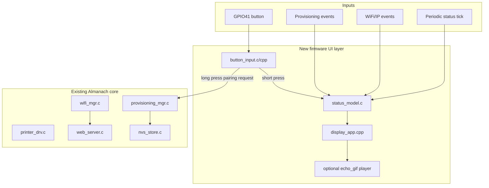
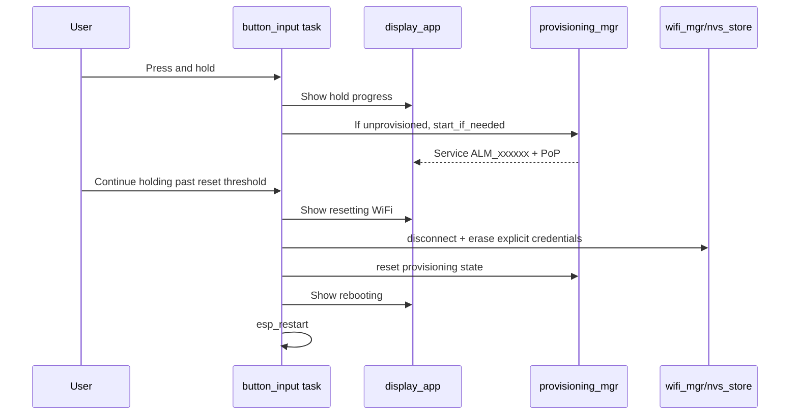

# AtomS3R Display Status and Long-Press BLE Pairing Design Guide

## Executive Summary

The Almanach AtomS3R firmware now has a standard ESP-IDF BLE WiFi provisioning path, but it still behaves like a headless device. The serial console can show provisioning state, the Linux CLI can query `proto-ver`, and the web server starts after WiFi connects, but a person holding the physical device cannot see whether it is waiting for pairing, connecting to WiFi, connected with an IP address, or in an error/reset state.

The `esp32-s3-m5` workspace contains several AtomS3R display experiments that solve the missing hardware pieces. The most relevant donors are `0013-atoms3r-gif-console`, which has GC9107 display bring-up, FATFS-backed GIF playback, and a queue-based control plane, and `0017-atoms3r-web-ui`, which has a reusable display wrapper, button ISR/task structure, WiFi status HTTP endpoint, and a simple boot/status screen. The target firmware is `almanach/firmware/atoms3r`, which already has the printer driver, WiFi manager, web server, BLE provisioning manager, and serial console commands.

The desired product behavior is:

- The display should show boot, provisioning, WiFi, IP address, printer, and error state without requiring serial monitor.
- A short button press can remain available for local UI behavior such as cycling status/detail pages or animations.
- A long button press should enter BLE pairing mode. In development this should call the existing provisioning manager and show service name plus proof-of-possession. For a full re-pairing flow, the long press should optionally reset stored WiFi/provisioning state after a clear hold threshold and then reboot or restart provisioning.
- GIF animations should remain possible, but status text must have priority over animation when the system needs to communicate actionable state.

This guide recommends adding three small subsystems to the Almanach firmware:

1. `display_hal` and `display_app` for AtomS3R LCD initialization, canvas presentation, status rendering, and optional GIF playback integration.
2. `button_input` for debounced short/long press detection using GPIO interrupts and a FreeRTOS task/timer state machine.
3. `status_model` or direct event-to-display update code that gathers WiFi/provisioning/printer state and renders it at a controlled rate.

The implementation should be staged. First make static text status work. Then add long-press pairing mode. Then add GIF/animation as a background layer. This order keeps firmware validation simple and prevents debugging display, button, GIF decoding, BLE provisioning, and WiFi connection state at the same time.

## Current Target Firmware Shape

The target is the standalone Almanach firmware under:

```text
almanach/firmware/atoms3r/
```

The current main component is C-only and registers these files in `main/CMakeLists.txt`:

```text
app_main.c
printer_drv.c
printer_cmd.c
wifi_mgr.c
wifi_cmd.c
nvs_store.c
provisioning_mgr.c
provisioning_cmd.c
web_server.c
```

The important current boot sequence is in `app_main.c`:

```c
void app_main(void)
{
    nvs_store_init();
    esp_netif_init();
    esp_event_loop_create_default();
    wifi_mgr_init();
    printer_drv_init();
    apply_saved_printer_settings();
    start_network_onboarding();
    xTaskCreate(web_server_task, "web_wait", 4096, NULL, 2, NULL);
    start_console_and_register_commands();
}
```

`start_network_onboarding()` already makes the core provisioning decision:

```c
if (provisioning_mgr_is_provisioned(&provisioned) && provisioned) {
    wifi_mgr_start_station();
} else if (nvs_store_load_wifi(...) == ESP_OK) {
    wifi_mgr_connect(ssid, password);
} else {
    provisioning_mgr_start_if_needed(&started);
}
```

The provisioning manager exposes the state needed for a display:

```c
typedef struct {
    bool initialized;
    bool provisioned;
    bool running;
    bool client_connected;
    bool security_ok;
    char service_name[32];
    char pop[32];
} provisioning_status_t;
```

The WiFi manager exposes connection and IP state:

```c
bool wifi_mgr_is_connected(void);
esp_err_t wifi_mgr_get_ip(char *buf, size_t buf_len);
```

This means the display feature does not need to invent a new networking state system. It needs a safe way to periodically read the existing state, render it, and let a long button press call existing provisioning APIs.

## Donor Firmware Inventory in `esp32-s3-m5`

### `0013-atoms3r-gif-console`

This is the best donor for real GIF animation and the control-queue idea. Its top-level file is:

```text
esp32-s3-m5/0013-atoms3r-gif-console/main/hello_world_main.cpp
```

It wires together:

- M5GFX display initialization.
- Backlight control.
- A full-screen `M5Canvas` sprite.
- FATFS storage mounted at `/storage`.
- A GIF registry under `/storage/gifs`.
- AnimatedGIF playback through `echo_gif`.
- A control queue consumed by the main playback loop.
- A button ISR that enqueues `CtrlType::Next`.
- Console commands for playback control.

The important loop structure is:

```cpp
while (true) {
    TickType_t wait_ticks = playing ? pdMS_TO_TICKS(delay_ms) : portMAX_DELAY;

    CtrlEvent ev = {};
    if (xQueueReceive(ctrl_q, &ev, wait_ticks) == pdTRUE) {
        handle_control_event(ev);
        continue;
    }

    if (!playing) {
        continue;
    }

    int frame_delay_ms = 0;
    int prc = echo_gif_player_play_frame(&frame_delay_ms, &gif_ctx);
    if (prc > 0 || echo_gif_player_last_error() == GIF_SUCCESS) {
        display_present_canvas(canvas);
        delay_ms = max(frame_delay_ms, CONFIG_ECHO_GIF_MIN_FRAME_DELAY_MS);
    }
}
```

This loop is not directly suitable for Almanach as-is because Almanach already has a printer/web/provisioning application loop. The reusable idea is not "make GIF playback own the whole app." The reusable idea is a display task that receives events and chooses what to render.

### `components/echo_gif`

This component is the best donor for streaming GIF playback. The relevant file is:

```text
esp32-s3-m5/components/echo_gif/src/gif_player.cpp
```

It uses `AnimatedGIF` callbacks to stream from FATFS instead of loading entire GIFs into RAM:

```cpp
static void *gif_open_cb(const char *path, int32_t *size) {
    FILE *f = fopen(path, "rb");
    ...
    return (void *)f;
}

static int32_t gif_read_cb(GIFFILE *pFile, uint8_t *pBuf, int32_t len) {
    FILE *f = (FILE *)pFile->fHandle;
    size_t n = fread(pBuf, 1, len, f);
    pFile->iPos += n;
    return n;
}
```

The draw callback writes RGB565 pixels directly into an `M5Canvas` buffer. It handles transparency, scaling, offsets, and optional byte swapping. This is useful for Almanach, but it should be added after static status rendering works.

### `0017-atoms3r-web-ui`

This is the best donor for display abstraction and button structure. Its display wrapper is:

```text
esp32-s3-m5/0017-atoms3r-web-ui/main/display_app.cpp
```

It provides:

```cpp
esp_err_t display_app_init(void);
void display_app_present(void);
void display_app_show_boot_screen(const char *line1, const char *line2);
esp_err_t display_app_png_from_file(const char *path);
```

This is closer to the shape Almanach should adopt. The display is initialized once, the canvas is kept as module state, and other firmware code can ask it to show a boot/status screen.

The button donor is:

```text
esp32-s3-m5/0017-atoms3r-web-ui/main/button_input.cpp
```

It uses a GPIO ISR to enqueue timestamped events, then a FreeRTOS task debounces and broadcasts JSON over WebSocket. Almanach does not need the WebSocket broadcast behavior, but the ISR-to-task split is correct. The ISR should do minimal work; long-press logic belongs in task context.

### `0014-atoms3r-animatedgif-single`

This is useful as a low-level reference for AtomS3R display wiring and AnimatedGIF bring-up. It documents the fixed display pins:

```text
DISP_CS    = GPIO14
SPI_SCK    = GPIO15
SPI_MOSI   = GPIO21
DISP_RS/DC = GPIO42
DISP_RST   = GPIO48
```

It also documents AtomS3R backlight details:

- Backlight gate GPIO can be GPIO7, active-low.
- I2C brightness controller can live at address `0x30` on SCL GPIO0 and SDA GPIO45.
- Brightness register is commonly `0x0e`.

The later `0013` and `0017` projects already carry these settings forward through Kconfig and helper modules, so use them instead of copying from `0014` directly.

## Hardware Facts to Preserve

The AtomS3R display is a 128x128 visible window on a GC9107-style panel. The panel controller has a 128x160 memory area, and the visible square typically starts at a Y offset of 32. The donor Kconfig defaults encode this:

```text
LCD_HRES        = 128
LCD_VRES        = 128
LCD_X_OFFSET    = 0
LCD_Y_OFFSET    = 32
LCD_SPI_PCLK_HZ = 40000000
```

The display bus uses SPI3 through LovyanGFX/M5GFX:

```cpp
cfg.spi_host = SPI3_HOST;
cfg.spi_3wire = true;
cfg.freq_write = CONFIG_..._LCD_SPI_PCLK_HZ;
cfg.pin_sclk = 15;
cfg.pin_mosi = 21;
cfg.pin_miso = -1;
cfg.pin_dc = 42;
```

The panel pins are:

```cpp
pcfg.pin_cs = 14;
pcfg.pin_rst = 48;
pcfg.panel_width = 128;
pcfg.panel_height = 128;
pcfg.offset_x = 0;
pcfg.offset_y = 32;
```

The button is configured as GPIO41, active-low, in both `0013` and `0017` donor projects:

```text
BUTTON_GPIO       = 41
BUTTON_ACTIVE_LOW = y
BUTTON_DEBOUNCE_MS = 50
```

These values should be copied into Almanach-specific Kconfig names rather than retaining tutorial-prefixed symbols. For example:

```text
CONFIG_ALMANACH_ATOMS3R_DISPLAY_ENABLE=y
CONFIG_ALMANACH_ATOMS3R_LCD_HRES=128
CONFIG_ALMANACH_ATOMS3R_LCD_VRES=128
CONFIG_ALMANACH_ATOMS3R_LCD_Y_OFFSET=32
CONFIG_ALMANACH_ATOMS3R_BUTTON_GPIO=41
CONFIG_ALMANACH_ATOMS3R_BUTTON_ACTIVE_LOW=y
CONFIG_ALMANACH_ATOMS3R_PAIRING_HOLD_MS=2500
```

## Proposed Almanach Architecture

The display and button feature should be added as an internal firmware UI layer. It should not make display code directly own WiFi, BLE, printer, or web-server behavior. Instead, the UI layer should consume status snapshots and send control requests.



The interface between core firmware and UI should be small:

```c
typedef enum {
    UI_SCREEN_BOOT,
    UI_SCREEN_PROVISIONING,
    UI_SCREEN_CONNECTING,
    UI_SCREEN_CONNECTED,
    UI_SCREEN_ERROR,
    UI_SCREEN_PAIRING_REQUESTED,
} ui_screen_t;

typedef struct {
    ui_screen_t screen;
    bool wifi_connected;
    char ip[16];
    bool provisioned;
    bool provisioning_running;
    bool provisioning_client_connected;
    bool provisioning_security_ok;
    char service_name[32];
    char pop[32];
    char message[64];
} ui_status_t;
```

The display task can render `ui_status_t`. The button task can request transitions or call provisioning APIs. The existing `wifi_mgr` and `provisioning_mgr` remain the sources of truth.

## Display State Model

The display should be readable at a glance. The 128x128 screen is small, so it should show a concise hierarchy rather than a full console dump.

Recommended screens:

| Screen | Trigger | Display content |
|---|---|---|
| Boot | app start | `Almanach`, firmware version, `Booting...` |
| Provisioning | BLE advertising | `PAIRING`, service name, PoP, `Hold: reset` or `Use CLI/app` |
| BLE client connected | protocomm BLE connect | `BLE connected`, service name, `Waiting security` or `Security OK` |
| WiFi connecting | credentials received or station start | `WiFi`, SSID if safe/available, `Connecting...` |
| Connected | `wifi_mgr_is_connected()` true | `ONLINE`, IP address, printer status summary |
| Web ready | web server started | `READY`, IP, `/almanach` or API hint |
| Error | credential failure or timeout | `ERROR`, reason, `Hold to pair` |
| Pairing requested | long press recognized | `PAIRING MODE`, reset/restart state, service name/PoP |

The display should intentionally omit secrets. It can show the PoP because current development firmware prints PoP to serial logs and the PoP is needed for pairing. It must never show WiFi passphrases.

A minimal connected screen can fit in 128x128:

```text
ALMANACH
ONLINE
192.168.1.42

Printer OK
Hold: Pair
```

A provisioning screen can fit:

```text
PAIR BLE
ALM_0F2320
PoP:
alm-0f2320

Hold reset
```

## Long-Press Pairing Behavior

The user request is: holding the button for a while should enter BLE pairing mode. There are two possible meanings of "pairing mode":

1. If the device is not provisioned and BLE provisioning is not running, start BLE provisioning.
2. If the device is already provisioned and connected, reset provisioning/WiFi state and return to BLE provisioning.

The second behavior is more useful physically, but it is destructive because it erases credentials. The design should therefore use a long-hold threshold and clear on-screen feedback.

Recommended thresholds:

| Gesture | Duration | Behavior |
|---|---:|---|
| Short press | release before 700 ms | Cycle display page or animation. |
| Long press | 2500 ms | Enter pairing mode if unprovisioned; if provisioned, show reset countdown. |
| Confirmed hold | 5000 ms | Clear WiFi/provisioning state and reboot into BLE provisioning. |

This provides a safe path:

- At 2.5 seconds, the display shows `Hold to reset WiFi` or `Release to cancel`.
- At 5 seconds, the firmware calls the reset path and reboots.
- If released before confirmation, no destructive action occurs.

If product preference is simpler, collapse this to one threshold. For development, the two-threshold model is safer.

### Button implementation pattern

Do not do long-press detection in the ISR. The ISR should only enqueue edge events with timestamps. The task should read GPIO level and compute press duration.

Pseudocode:

```c
typedef enum {
    BUTTON_EDGE_DOWN,
    BUTTON_EDGE_UP,
    BUTTON_TIMER_TICK,
} button_event_type_t;

typedef struct {
    button_event_type_t type;
    int64_t time_us;
    int level;
} button_event_t;
```

ISR:

```c
static void IRAM_ATTR button_isr(void *arg) {
    button_event_t ev = {
        .time_us = esp_timer_get_time(),
        .level = gpio_get_level(BUTTON_GPIO),
    };
    xQueueSendFromISR(button_q, &ev, &hp_task_woken);
}
```

Task:

```c
while (true) {
    button_event_t ev;
    xQueueReceive(button_q, &ev, timeout_for_next_hold_tick);

    bool pressed = active_low ? gpio_get_level(pin) == 0 : gpio_get_level(pin) != 0;

    if (pressed && !was_pressed) {
        press_start_us = now_us;
        long_announced = false;
        reset_announced = false;
    }

    if (pressed) {
        held_ms = (now_us - press_start_us) / 1000;
        if (held_ms >= PAIRING_HOLD_MS && !long_announced) {
            ui_show_pairing_hold_feedback();
            if (!device_is_provisioned()) {
                provisioning_mgr_start_if_needed(NULL);
            }
            long_announced = true;
        }
        if (held_ms >= PAIRING_RESET_HOLD_MS && !reset_announced) {
            ui_show_resetting();
            reset_wifi_and_provisioning_state();
            esp_restart();
        }
    }

    if (!pressed && was_pressed) {
        if (held_ms < SHORT_PRESS_MAX_MS) {
            ui_cycle_screen_or_animation();
        } else if (held_ms < PAIRING_RESET_HOLD_MS) {
            ui_show_cancelled_or_current_status();
        }
    }

    was_pressed = pressed;
}
```

The task should use a periodic timeout while pressed so it can detect a long hold even if no release edge arrives. That is the main difference from the current donor `0013` and `0017` button code, which only reacts to single edges.

## Pairing Mode Semantics

The existing provisioning manager has the correct primitives:

```c
provisioning_mgr_start_if_needed(&started);
provisioning_mgr_reset();
wifi_mgr_disconnect();
nvs_store_erase_wifi();
esp_restart();
```

The long-press handler should reuse the same reset semantics as `prov_reset` so the physical button and serial console behave consistently.

Recommended helper:

```c
esp_err_t app_enter_pairing_mode(bool force_reset)
{
    if (!force_reset) {
        bool started = false;
        return provisioning_mgr_start_if_needed(&started);
    }

    wifi_mgr_disconnect();
    nvs_store_erase_wifi();
    provisioning_mgr_reset();
    esp_restart();
    return ESP_OK;
}
```

Display behavior should be tied to this sequence:



## Display Rendering Strategy

Use an offscreen `M5Canvas` and present full frames. This is already proven by the donors. For status rendering, full-frame redraws are simple and reliable.

Recommended module shape:

```text
main/display_hal.cpp
main/display_hal.h
main/display_app.cpp
main/display_app.h
main/button_input.cpp or button_input.c
main/button_input.h
main/ui_status.c or ui_status.cpp
main/ui_status.h
```

Because the donor display code uses M5GFX C++ APIs, the main component must compile C++ files. ESP-IDF supports mixed C and C++ components. Keep `app_main.c` as C initially, expose C-compatible functions from the display/button headers, and wrap C++ headers with `extern "C"`.

Example `display_app.h` boundary:

```c
#pragma once
#include "esp_err.h"

#ifdef __cplusplus
extern "C" {
#endif

typedef struct {
    bool wifi_connected;
    char ip[16];
    bool provisioning_running;
    bool provisioning_client_connected;
    bool provisioning_security_ok;
    char service_name[32];
    char pop[32];
    char message[64];
} display_status_t;

esp_err_t display_app_init(void);
void display_app_show_boot(const char *line1, const char *line2);
void display_app_show_status(const display_status_t *status);
void display_app_show_pairing_hold(uint32_t held_ms, uint32_t target_ms);
void display_app_show_error(const char *line1, const char *line2);

#ifdef __cplusplus
}
#endif
```

A simple renderer should avoid dynamic allocation after initialization. It can reuse the canvas created during `display_app_init()`:

```cpp
void display_app_show_status(const display_status_t *st) {
    s_canvas.fillScreen(TFT_BLACK);
    s_canvas.setTextColor(TFT_WHITE, TFT_BLACK);
    s_canvas.setTextSize(1);
    s_canvas.setCursor(0, 0);

    s_canvas.println("ALMANACH");
    if (st->wifi_connected) {
        s_canvas.setTextColor(TFT_GREEN, TFT_BLACK);
        s_canvas.println("ONLINE");
        s_canvas.setTextColor(TFT_WHITE, TFT_BLACK);
        s_canvas.println(st->ip);
    } else if (st->provisioning_running) {
        s_canvas.setTextColor(TFT_CYAN, TFT_BLACK);
        s_canvas.println("PAIR BLE");
        s_canvas.setTextColor(TFT_WHITE, TFT_BLACK);
        s_canvas.println(st->service_name);
        s_canvas.println(st->pop);
    } else {
        s_canvas.setTextColor(TFT_YELLOW, TFT_BLACK);
        s_canvas.println("WIFI WAIT");
    }

    s_canvas.setCursor(0, 112);
    s_canvas.setTextColor(TFT_DARKGREY, TFT_BLACK);
    s_canvas.println("Hold: Pair");
    display_app_present();
}
```

## GIF and Status Coexistence

GIF playback should not prevent status updates. The donor `0013` app lets GIF playback own the main loop, but Almanach needs a status-priority display task. The display task should decide between background animation and overlay/status pages.

Recommended policy:

- Boot, error, pairing, and reset screens are exclusive. They pause or hide GIF playback.
- Connected/ready screen may optionally show an animated background with text overlay, but only after static text has been validated.
- If GIF decoding fails, the display should fall back to text; GIF failure must not affect provisioning or printing.

A display task can implement this with modes:

```c
typedef enum {
    DISPLAY_MODE_STATUS_ONLY,
    DISPLAY_MODE_GIF_BACKGROUND,
    DISPLAY_MODE_ALERT,
} display_mode_t;
```

Task pseudocode:

```c
while (true) {
    display_event_t ev;
    if (xQueueReceive(display_q, &ev, next_frame_delay) == pdTRUE) {
        update_display_model(ev);
        render_status_frame();
        continue;
    }

    if (mode == DISPLAY_MODE_GIF_BACKGROUND && no_alert_active) {
        play_one_gif_frame();
        draw_status_overlay();
        present();
    }
}
```

This keeps animation opportunistic. Status remains deterministic.

## Build Integration

The target Almanach firmware currently does not depend on M5GFX, AnimatedGIF, or `echo_gif`. Add display support in layers.

### Phase 1 component changes

Add M5GFX and C++ display files first:

```cmake
idf_component_register(
    SRCS
        "app_main.c"
        ...
        "display_hal.cpp"
        "display_app.cpp"
        "button_input.cpp"
    PRIV_REQUIRES
        console
        esp_driver_gpio
        esp_driver_spi
        esp_driver_i2c
        esp_timer
        ...
    REQUIRES
        M5GFX
    INCLUDE_DIRS "."
)
```

If the Almanach project does not yet have `idf_component.yml` entries or managed-component dependencies for M5GFX, copy the pattern from `0013` or `0017`. Do not add AnimatedGIF until the text display is working.

### Phase 2 Kconfig/defaults

Add Almanach-specific Kconfig symbols rather than tutorial symbols. Either create `main/Kconfig.projbuild` or add the equivalent defaults to `sdkconfig.defaults` if the project wants fewer menuconfig options.

Recommended Kconfig sections:

```text
menu "Almanach AtomS3R Display"
config ALMANACH_ATOMS3R_DISPLAY_ENABLE
config ALMANACH_ATOMS3R_LCD_HRES
config ALMANACH_ATOMS3R_LCD_VRES
config ALMANACH_ATOMS3R_LCD_Y_OFFSET
config ALMANACH_ATOMS3R_CANVAS_USE_PSRAM
config ALMANACH_ATOMS3R_PRESENT_USE_DMA
endmenu

menu "Almanach AtomS3R Button"
config ALMANACH_ATOMS3R_BUTTON_GPIO
config ALMANACH_ATOMS3R_BUTTON_ACTIVE_LOW
config ALMANACH_ATOMS3R_BUTTON_DEBOUNCE_MS
config ALMANACH_ATOMS3R_PAIRING_HOLD_MS
config ALMANACH_ATOMS3R_PAIRING_RESET_HOLD_MS
endmenu
```

### Phase 3 GIF dependencies

After status and long-press pairing are validated, add:

```cmake
REQUIRES
    M5GFX
    animatedgif
    echo_gif
```

Also copy or reference the `echo_gif` component from `esp32-s3-m5/components/echo_gif`. If Almanach should stay standalone, vendor the component under `almanach/firmware/atoms3r/components/echo_gif` or a shared top-level component directory. Do not make the standalone Almanach repo depend on relative paths into `../esp32-s3-m5`.

## Implementation Phases

### Phase 1: Port static display bring-up

Goal: boot Almanach firmware and show a static status screen.

Steps:

1. Copy/adapt `display_hal.cpp/.h` from `0017-atoms3r-web-ui` or `0013-atoms3r-gif-console`.
2. Copy/adapt `backlight.cpp/.h` from `0013` or `0017`.
3. Copy/adapt `display_app.cpp/.h` from `0017`.
4. Rename Kconfig symbols from `TUTORIAL_0017_*` to `ALMANACH_ATOMS3R_*`.
5. Add C++ source files to `main/CMakeLists.txt`.
6. Add `M5GFX`, `esp_driver_spi`, and `esp_driver_i2c` dependencies.
7. Call `display_app_init()` early in `app_main()` after NVS/logging but before long operations.
8. Show `Almanach / Booting...`.
9. Build, flash, and confirm display output.

Validation:

```bash
cd almanach/firmware/atoms3r
./build.sh /dev/ttyACM0 build
./build.sh /dev/ttyACM0 flash
./build.sh /dev/ttyACM0 monitor
```

Pass criteria:

- Firmware boots without panic.
- Backlight turns on after panel initialization.
- Display shows the boot screen.
- Printer UART and existing console still work.

### Phase 2: Add periodic status display

Goal: show provisioning and IP state on the LCD.

Steps:

1. Add a `ui_status_task` or integrate a display status timer.
2. Every 500-1000 ms, read:
   - `provisioning_mgr_get_status()`.
   - `wifi_mgr_is_connected()`.
   - `wifi_mgr_get_ip()` if connected.
3. Render one of the status screens.
4. Keep rendering rate low to avoid wasting CPU and SPI bandwidth.

Pseudocode:

```c
static void ui_status_task(void *arg)
{
    while (true) {
        display_status_t ds = {0};
        provisioning_status_t ps = {0};
        provisioning_mgr_get_status(&ps);

        ds.provisioning_running = ps.running;
        ds.provisioning_client_connected = ps.client_connected;
        ds.provisioning_security_ok = ps.security_ok;
        strlcpy(ds.service_name, ps.service_name, sizeof(ds.service_name));
        strlcpy(ds.pop, ps.pop, sizeof(ds.pop));

        ds.wifi_connected = wifi_mgr_is_connected();
        if (ds.wifi_connected) {
            wifi_mgr_get_ip(ds.ip, sizeof(ds.ip));
        }

        display_app_show_status(&ds);
        vTaskDelay(pdMS_TO_TICKS(1000));
    }
}
```

Pass criteria:

- Erased device shows BLE pairing service name and PoP.
- Connected device shows IP address.
- WiFi timeout/error state is visible without serial monitor.

### Phase 3: Add long-press button detection

Goal: holding GPIO41 enters BLE pairing/reset flow.

Steps:

1. Copy/adapt `button_input.cpp` ISR/task structure from `0017`.
2. Change interrupt type to both edges if supported, or keep edge ISR and poll while pressed.
3. Add hold-duration state machine in task context.
4. On pairing threshold:
   - If unprovisioned, call `provisioning_mgr_start_if_needed()`.
   - Show pairing screen.
5. On reset threshold:
   - Call the same reset sequence as `prov_reset`.
   - Show reset/reboot screen.

Do not call `provisioning_mgr_reset()` directly from the ISR. Do not call `esp_restart()` from the ISR.

Pass criteria:

- Short press does not reset credentials.
- Long press on unprovisioned device starts or confirms BLE pairing screen.
- Long-confirm press on provisioned device clears credentials and returns to BLE advertising after reboot.

### Phase 4: Add display event hooks

Goal: update the display promptly when provisioning state changes, rather than relying only on polling.

Steps:

1. Add optional UI notification calls in provisioning event handler:
   - `WIFI_PROV_START` -> show pairing.
   - `PROTOCOMM_TRANSPORT_BLE_CONNECTED` -> show client connected.
   - `PROTOCOMM_SECURITY_SESSION_SETUP_OK` -> show security OK.
   - `WIFI_PROV_CRED_RECV` -> show WiFi connecting.
   - `WIFI_PROV_CRED_FAIL` -> show error.
   - `WIFI_PROV_CRED_SUCCESS` -> show success/connecting.
2. Add optional UI notification in WiFi manager when IP arrives.
3. Keep polling as a fallback.

Recommended pattern:

```c
void ui_notify(ui_event_t ev);
```

The event handler should enqueue UI events, not render directly. Rendering from event callbacks can create lock-order or timing problems.

### Phase 5: Add GIF background or screensaver

Goal: reintroduce GIF animations after the status path is stable.

Steps:

1. Vendor or add the `echo_gif` component.
2. Mount a FATFS storage partition for GIFs, or embed a small default animation.
3. Add GIF playback to the display task as a background mode.
4. Overlay concise status text or switch to text-only mode for provisioning/errors.
5. Add console command or button short press to cycle animations if desired.

Pass criteria:

- GIF playback does not block status updates.
- Provisioning screen interrupts GIF playback immediately.
- GIF decode errors fall back to text.
- Heap remains stable over long playback.

## API References and File References

### ESP-IDF APIs

- GPIO input/interrupts:
  - `gpio_config()`
  - `gpio_install_isr_service()`
  - `gpio_isr_handler_add()`
  - `gpio_get_level()`
- Timing:
  - `esp_timer_get_time()`
  - `vTaskDelay()`
  - FreeRTOS queue timeouts
- Queues/tasks:
  - `xQueueCreate()`
  - `xQueueSendFromISR()`
  - `xQueueReceive()`
  - `xTaskCreate()`
- Provisioning:
  - `wifi_prov_mgr_start_provisioning()`
  - `wifi_prov_mgr_is_provisioned()`
  - `wifi_prov_mgr_reset_provisioning()`
  - `WIFI_PROV_EVENT`
  - `PROTOCOMM_TRANSPORT_BLE_EVENT`
  - `PROTOCOMM_SECURITY_SESSION_EVENT`
- WiFi/IP:
  - `esp_wifi_start()`
  - `esp_wifi_connect()`
  - `IP_EVENT_STA_GOT_IP`
  - `esp_netif_get_ip_info()`

### Donor files

- `esp32-s3-m5/0013-atoms3r-gif-console/main/hello_world_main.cpp`
- `esp32-s3-m5/0013-atoms3r-gif-console/main/control_plane.cpp`
- `esp32-s3-m5/0013-atoms3r-gif-console/main/display_hal.cpp`
- `esp32-s3-m5/0013-atoms3r-gif-console/main/backlight.cpp`
- `esp32-s3-m5/components/echo_gif/src/gif_player.cpp`
- `esp32-s3-m5/components/echo_gif/src/gif_registry.cpp`
- `esp32-s3-m5/components/echo_gif/src/gif_storage.cpp`
- `esp32-s3-m5/0017-atoms3r-web-ui/main/display_app.cpp`
- `esp32-s3-m5/0017-atoms3r-web-ui/main/button_input.cpp`
- `esp32-s3-m5/0017-atoms3r-web-ui/main/Kconfig.projbuild`

### Target files

- `almanach/firmware/atoms3r/main/app_main.c`
- `almanach/firmware/atoms3r/main/provisioning_mgr.c`
- `almanach/firmware/atoms3r/main/provisioning_mgr.h`
- `almanach/firmware/atoms3r/main/provisioning_cmd.c`
- `almanach/firmware/atoms3r/main/wifi_mgr.c`
- `almanach/firmware/atoms3r/main/wifi_mgr.h`
- `almanach/firmware/atoms3r/main/CMakeLists.txt`
- `almanach/firmware/atoms3r/sdkconfig.defaults`

## Validation Plan

### Static display validation

1. Build after adding display files.
2. Flash AtomS3R.
3. Confirm boot screen appears.
4. Confirm serial console still starts.
5. Confirm printer initialization still runs.

### Provisioning display validation

1. Erase flash.
2. Flash firmware.
3. Confirm display shows pairing status with service name and PoP.
4. Confirm serial `prov_status` matches the display.
5. Run Linux CLI version check:

```bash
go run ./cmd/almanach-render-service ble-provision \
  --action version \
  --service-name ALM_0F2320 \
  --pop alm-0f2320 \
  --timeout 30 \
  --output yaml
```

6. Confirm display changes on BLE client connected/security events if event hooks are implemented.

### Long-press validation

1. Boot with no credentials.
2. Hold button to pairing threshold.
3. Confirm display shows pairing mode.
4. Provision WiFi.
5. Reboot and confirm connected/IP display.
6. Hold button to reset threshold.
7. Confirm display shows reset/reboot.
8. Confirm device returns to BLE pairing state.

### GIF validation

1. Flash a FATFS storage partition with known 128x128 GIFs.
2. Confirm GIF playback on connected/idle screen.
3. Trigger pairing/reset and confirm text status takes over.
4. Let GIF run for at least 30 minutes and watch heap logs.

## Risks and Mitigations

### Risk: Display code introduces C++ dependency into a C firmware

Mitigation: keep C-compatible headers and isolate M5GFX usage in `.cpp` files. ESP-IDF supports mixed C/C++ components.

### Risk: GIF playback blocks provisioning or WiFi tasks

Mitigation: make GIF playback a low-priority display task mode and render one frame at a time with queue receive timeouts. Do not run GIF playback in the main application task.

### Risk: Long press accidentally erases WiFi credentials

Mitigation: use a two-threshold hold model and show on-screen countdown/confirmation before reset. Short press must never erase credentials.

### Risk: Backlight or display bus conflicts with existing hardware

Mitigation: use the donor AtomS3R pin configuration exactly, then validate printer UART pins separately. The display uses SPI pins 14/15/21/42/48 and backlight pins 7/0/45; the printer currently uses UART pins 7/8/6 in the Almanach firmware. This is the largest hardware conflict to review carefully.

### Critical Hardware Conflict: GPIO7

The donor display code uses GPIO7 as an active-low backlight gate. The Almanach printer code has been using GPIO7 as part of the printer UART pin swap path. This must be resolved before implementation.

The implementation must answer:

- Is the target board AtomS3R Lite with integrated display backlight on GPIO7?
- Is the printer UART really using GPIO7 on the same build?
- Can the printer TX/RX mapping move to non-conflicting pins?
- Does the backlight gate need to be disabled because I2C brightness control is sufficient?

Do not blindly copy donor backlight GPIO behavior into the printer firmware without checking this conflict. If GPIO7 is needed for the printer, make `ALMANACH_ATOMS3R_BACKLIGHT_GATE_ENABLE=n` initially and rely on I2C brightness, or choose a board-specific pin mapping that preserves the printer.

## Recommended First Implementation

The first implementation should be intentionally small:

1. Add `display_hal.cpp`, `backlight.cpp`, and `display_app.cpp` with text-only status screens.
2. Disable the GPIO7 backlight gate by default until the printer pin conflict is resolved.
3. Add a polling `ui_status_task` that renders provisioning and IP status once per second.
4. Add long-press detection but make the first version only call `provisioning_mgr_start_if_needed()` on unprovisioned devices.
5. Add destructive reset only after the display can show hold progress and cancellation.
6. Add GIF playback only after the above is hardware-validated.

This sequence gives a useful display quickly and avoids coupling the highest-risk parts together.

## Intern Checklist

Before coding:

- [ ] Read this guide.
- [ ] Read `0013-atoms3r-gif-console/main/hello_world_main.cpp`.
- [ ] Read `0013-atoms3r-gif-console/main/display_hal.cpp`.
- [ ] Read `0017-atoms3r-web-ui/main/display_app.cpp`.
- [ ] Read `0017-atoms3r-web-ui/main/button_input.cpp`.
- [ ] Read target `almanach/firmware/atoms3r/main/app_main.c`.
- [ ] Read target `provisioning_mgr.c/.h` and `wifi_mgr.c/.h`.
- [ ] Resolve the GPIO7 backlight/printer conflict before enabling backlight gate control.

During implementation:

- [ ] Keep display code behind `display_app_*` functions.
- [ ] Do not render from ISRs or ESP event callbacks.
- [ ] Do not call reset/reboot from ISR context.
- [ ] Keep WiFi passphrases off the display.
- [ ] Keep serial console recovery commands working.
- [ ] Validate each phase on hardware before adding the next.

After implementation:

- [ ] Erase flash and confirm pairing screen.
- [ ] Hold button and confirm pairing behavior.
- [ ] Provision WiFi and confirm IP screen.
- [ ] Reboot and confirm connected screen.
- [ ] Hold reset threshold and confirm fresh BLE pairing state.
- [ ] If GIFs are enabled, run a long heap-stability test.
