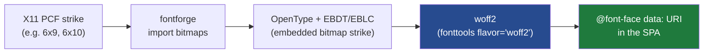

# Crisp small text via pixel bitmap fonts: design and implementation

## 1. Executive summary

The Almanach render pipeline turns an HTML page into a 1-bit thermal bitmap:
headless Chrome renders the React studio, a screenshot of `.paper-body` is
captured at device-pixel-ratio 1, and every pixel is thresholded to black or
white. Paper testing in `ALMANACH-RASTER-LAB` proved that small text
(roughly 8–11 px) prints with missing strokes. The cause is upstream of the
printer: a vector font rendered at a small size draws strokes thinner than one
pixel, the font rasterizer represents them with **anti-aliasing** as light-gray
pixels, and the 1-bit conversion discards those light-gray pixels. The same
lab work proved the fix: a **bitmap/pixel font**, whose glyphs are authored at
an exact pixel size with every stroke a solid one-bit pixel, renders with no
anti-aliasing and therefore nothing for the threshold to drop. On paper, a 6×9
bitmap font out-read an 11 px anti-aliased vector font.

This document specifies how to bring that result into the production render
path. The recommended approach is an **embedded-bitmap web font** served to the
SPA and applied to small-text elements, rendered at its native pixel size while
the pipeline already captures at device-pixel-ratio 1. Two fallback approaches
(disable anti-aliasing for the render browser; composite bitmap text host-side)
are specified in case the primary approach fails an early rendering spike.

This work is **frontend + render-process only**. It does not change the printer
firmware, the packed-bitmap contract, or the rasterizer. Per-segment printer
heat (the sibling follow-up from `ALMANACH-RASTER-LAB`) is an explicit non-goal.

## 2. Background: why small text drops

The 1-bit conversion is a single comparison per pixel (`internal/app/bitmap.go`):

```
gray = 0.299R + 0.587G + 0.114B
out(x, y) = gray < threshold        # threshold defaults to 128
```

A vector glyph stroke narrower than one device pixel cannot be represented by a
solid pixel. FreeType (the rasterizer Chrome uses on Linux) instead shades the
partially-covered pixels in proportion to coverage, producing gray values. A
1-pixel stroke that covers 40 percent of a pixel column becomes gray ≈ 190.
Since 190 is greater than 128, the threshold discards it, and the stroke
disappears. Whole terminals of letters vanish this way, which is why the 8–9 px
lines in the lab's text card broke up while the same text in a bitmap font
stayed intact.

A bitmap font removes the anti-aliasing entirely. Its glyphs are stored as
explicit pixel grids at specific sizes; at a matching size the rasterizer copies
the stored pixels verbatim, so every pixel is either fully black or fully white
and the threshold has nothing to drop. The counters (the enclosed holes in
letters such as e, a, g) are authored open, so they do not fill in.

## 3. The device-pixel constraint

A bitmap font only renders verbatim when the requested pixel size matches an
available strike and the glyph lands on integer pixel boundaries. Two facts make
this achievable in the current pipeline:

- The render browser is pinned to device-pixel-ratio 1 by
  `chromedp.Flag("force-device-scale-factor", "1.0")` in
  `newChromeAllocatorWithViewport` (`internal/app/renderer.go:428`). A CSS
  `font-size: 9px` therefore requests a 9-device-pixel glyph.
- The paper element is a fixed CSS pixel width (default 384, the thermal head's
  dot count), so one CSS pixel equals one bitmap dot. The screenshot of
  `.paper-body` is captured at that 1:1 scale and handed straight to the
  rasterizer.

The consequence: if a small-text element uses a bitmap font whose strike size
equals its `font-size` in pixels, the glyphs land exactly on the dot grid. The
sizes that matter are the small ones — captions, footnotes, dense body text —
where anti-aliasing does the damage. Large text already has a solid black core
and is unaffected, so it can keep the existing serif/sans vector fonts.

## 4. Approaches considered

### Approach A (recommended): embedded-bitmap web font

Convert a classic bitmap font (the X11 PCF fonts already bundled in
`ALMANACH-RASTER-LAB`, e.g. 6x9, 6x10) into an OpenType font that carries
**embedded monochrome bitmap strikes** (the `EBDT`/`EBLC` tables), then to
`woff2`, embed it in the SPA via `@font-face`, and apply it to a small-text CSS
class. FreeType renders the strike at the matching pixel size with no
anti-aliasing.

- **Strengths:** self-contained in the SPA; no render-process configuration; the
  glyphs are exactly the pixel-perfect designs validated on paper; other text on
  the page is unaffected; deterministic and reproducible.
- **Weaknesses:** requires a font-conversion toolchain (fontforge, available
  here via `APPIMAGE_EXTRACT_AND_RUN=1`); the strike is legible only at its
  native size, so the CSS must use the exact px size the strike was authored for.
- **Risk:** Blink might apply subpixel positioning that blurs even a bitmap
  strike. This is the primary thing the early spike must falsify.

### Approach B: disable anti-aliasing for the render browser

Render text with a vector pixel font (or even the existing fonts) but disable
grayscale anti-aliasing so FreeType uses its monochrome rasterizer, which
threshold-renders each pixel. On Linux this is controlled by fontconfig, not by
CSS (`-webkit-font-smoothing` is a no-op in Chrome/Linux). A fontconfig snippet
with `antialias=false` supplied to the render process via `FONTCONFIG_FILE`
would make all text render 1-bit.

- **Strengths:** cheap; needs no new font asset; makes every glyph pure black or
  white so nothing is ever threshold-dropped.
- **Weaknesses:** affects **all** text on the page, including large display type
  that looked good anti-aliased; FreeType's monochrome rasterizer at small sizes
  without hinting can still thin or break strokes for fonts not designed for it;
  couples the visual result to a render-process environment variable that is easy
  to lose.
- **Use as:** a complement to A (pairing a pixel font with AA off is strictly
  crisper) or a fast fallback if A fails the spike.

### Approach C: composite bitmap text host-side

Render text blocks server-side with the bundled PCF fonts (exactly as the lab's
Python harness does) and paste them into the screenshot region.

- **Strengths:** total control; already proven in the lab.
- **Weaknesses:** duplicates the browser's layout engine; requires knowing block
  geometry; abandons the HTML-first model that is the point of Almanach. Reserved
  as a last resort.

### Decision

Pursue **Approach A**, with **Approach B (AA off) as a paired enhancement and
fallback**. Gate the choice on an early rendering spike (Task 1) that prints a
candidate bitmap web font in headless Chrome at 384 px and checks, by converting
the screenshot to 1-bit, that small glyphs are pure black/white with open
counters. If Blink blurs the strike, fall back to B.

## 5. The font toolchain

The bundled PCF fonts live at
`ttmp/2026/05/10/.../` and were copied into the raster-lab ticket at
`scripts/fonts/*.pcf`. The conversion chain is:



fontforge runs headless via `APPIMAGE_EXTRACT_AND_RUN=1 fontforge -lang=py -script convert.py`.
The script opens the PCF (or a BDF exported from it), ensures the bitmap strike
is retained, and generates an OpenType font with `bitmap` output so the strike
survives in `EBDT`/`EBLC`. `fontTools` then re-saves it with `flavor="woff2"`.
The result is a small (a few KB) self-contained web font. The exact fontforge
API calls are worked out in Task 2; the key flag is generating with
`'otf'` plus `bitmap` strikes rather than outlines-only.

Two candidate faces are worth shipping: a 9 px strike (6x9) for the smallest
captions and a 10 px strike (6x10) as the general small-text face. Both were the
paper sweet spot.

## 6. Integration points

### SPA (`web/`)

- **Font asset + `@font-face`.** Fonts are embedded as base64 in
  `web/src/fonts-embedded.css` (auto-generated) and `web/dist/fonts.css`. The new
  pixel face is added the same way, or in a small hand-written CSS file so it is
  not clobbered by the font-embedding generator. `@font-face` declares
  `font-family: 'AlmanachPixel'` with the `woff2` data URI.
- **A small-text style hook.** The studio renders blocks in
  `web/src/almanach-studio.jsx` (the `ThermalPaper`/block components around
  lines 1188+). Small text needs a way to opt into the pixel face: a CSS class
  such as `.pixel-text`, a block-level `font: pixel` option, or a theme that maps
  captions/footnotes to `AlmanachPixel` at the strike's native px. The exact
  hook is chosen in Task 4; the constraint is that whatever size the element
  uses must equal the strike size (9 or 10 px) at device-pixel-ratio 1.
- **`image-rendering` and smoothing.** Set `image-rendering: pixelated` is not
  relevant to fonts, but the small-text element should avoid CSS transforms,
  fractional line-heights, and letter-spacing that push glyphs off integer
  pixels.

### Render process (`internal/app/renderer.go`)

- Device-pixel-ratio is already 1; no change needed for Approach A.
- For Approach B (if used), add a fontconfig file disabling anti-aliasing and
  pass `FONTCONFIG_FILE` to the Chrome exec allocator, or add the appropriate
  Chrome font flags in `newChromeAllocatorWithViewport`.
- The screenshot → threshold path (`renderWithChrome` → `PngToBitmap`) is
  unchanged; threshold is the correct 1-bit mode for text.

## 7. Verification strategy

Small-text quality cannot be judged from a browser preview alone, because the
question is what survives the 1-bit conversion. The verification chain mirrors
the lab's method but automates the digital half:

1. **Rendering spike (headless Chrome).** Load an HTML page that shows the same
   caption in the candidate pixel font and in the current vector font at 8/9/10
   px, at a 384 px width, and screenshot it. This can be driven by the bundled
   Chromium directly or by the Playwright tooling.
2. **1-bit check.** Convert the screenshot to 1-bit at threshold 128 (the same
   `PngToBitmap` rule) and confirm the pixel-font glyphs are pure black/white
   with open counters while the vector glyphs show gray fringing / dropped
   strokes. This is a scriptable, repeatable check.
3. **End-to-end render.** Run the Almanach `render` command (`--debug-dir`) on a
   layout that uses the small-text style, and inspect the emitted `bitmap.png`
   to confirm the glyphs survive the real pipeline.
4. **On-paper confirmation.** Print one page and read it, closing the loop with
   the same hardware used in `ALMANACH-RASTER-LAB`.

## 8. Risks and mitigations

- **Blink subpixel positioning blurs the strike.** Falsify early in the spike;
  mitigate with `text-rendering: geometricPrecision` off, integer positions, and
  Approach B (AA off) as backup.
- **Strike-size coupling.** The pixel font is crisp only at its native size.
  Mitigate by defining named CSS classes bound to specific px sizes
  (`.pixel-9`, `.pixel-10`) rather than letting arbitrary sizes use the face.
- **Font-embedding generator clobbers the CSS.** Keep the pixel `@font-face` in a
  separate, hand-maintained file that the generator does not overwrite, and
  document it.
- **Coverage gaps.** Classic X11 strikes cover Latin-1 well; verify the glyph set
  the almanach content needs (digits, punctuation, common accents) before
  shipping.

## 9. Non-goals

- Per-segment printer heat (tracked separately as the other `ALMANACH-RASTER-LAB`
  follow-up).
- Changing the rasterizer, the packed-bitmap contract, or the firmware.
- Dithering or tone-curve work (already shipped for photos).
- A general web-font pipeline; this ships one or two specific pixel faces.

## 10. Phased implementation plan

The plan is ordered so the riskiest unknown (does a bitmap web font render crisp
in Chrome?) is resolved first, before any SPA wiring.

- **Phase 0 — Spike.** Produce a candidate bitmap `woff2` and prove it renders
  1-bit-crisp in headless Chrome at 384 px, versus the current vector font.
- **Phase 1 — Font asset.** Finalize the conversion script (PCF → embedded-bitmap
  OpenType → woff2) for the 9 px and 10 px faces; store the script and the
  generated fonts in the ticket and the web assets.
- **Phase 2 — SPA integration.** Add the `@font-face` and a small-text style
  hook; build the SPA.
- **Phase 3 — End-to-end verification.** Render a small-text layout through the
  Almanach pipeline and confirm the 1-bit output; add an automated check.
- **Phase 4 — Paper confirmation + docs.** Print, read, record; update the guide
  and diary.

## 11. File references

- `internal/app/bitmap.go` — the 1-bit threshold that drops anti-aliased strokes.
- `internal/app/renderer.go` — Chrome allocator (`force-device-scale-factor 1.0`),
  screenshot capture, `PngToBitmap` call.
- `web/src/almanach-studio.jsx` — studio/block rendering and existing font
  families; the small-text hook lands here.
- `web/src/fonts-embedded.css`, `web/dist/fonts.css` — how fonts are embedded.
- `ALMANACH-RASTER-LAB` (`ttmp/2026/07/16/...`) — the paper evidence, the bundled
  PCF fonts (`scripts/fonts/*.pcf`), and the small-text comparison result.
