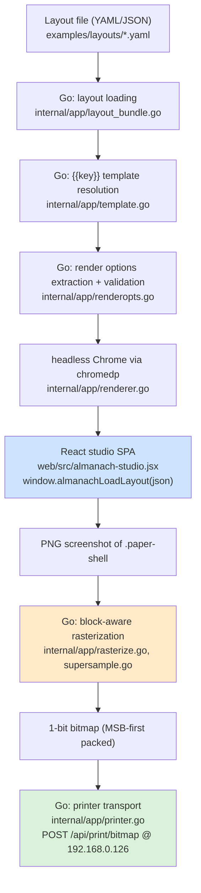

# Work-slip integration: analysis, design, and implementation guide

This document is written for someone who has never seen this repository before.
It explains what Almanach is, how a layout becomes ink on thermal paper, which
parts of the system this ticket touches, and exactly how to implement each
phase. Read it top to bottom once; afterwards you should be able to navigate
straight to any file it names.

## Executive Summary

Almanach renders small "almanac" pages — daily plans, quotes, word-of-the-day
strips — onto a 58 mm thermal receipt printer. The pipeline is: a JSON/YAML
**layout** describes an ordered list of **blocks**; a React SPA (the "studio")
renders those blocks to HTML/CSS; a Go service screenshots that HTML with
headless Chrome; the screenshot is converted to a 1-bit bitmap (threshold or
dithering, per block region); the bitmap is POSTed to the printer over HTTP.

A separate prototype, `slip-studio.html`, explored a different *content
domain*: work and freelance logistics — Upwork job slips, triage cards, daily
focus cards, pipeline stats — with a bold Swiss/brutalist visual language and a
vocabulary of **generic layout primitives** (banner, two-column row, key/value
table, checkbox rows, write-in lines, QR codes, bar charts). That prototype is
a single HTML file with its own canvas renderer; its renderer is *worse* than
Almanach's pipeline (no dithering, no per-region heat, CDN fonts), but its
block vocabulary and visual language are exactly what Almanach lacks.

This ticket integrates the valuable parts of slip-studio into Almanach:

1. **Phase 1 — hardening:** remove the `{{$ENV}}` environment-variable
   template feature (an env-exfiltration footgun) and pin down, with a test,
   that the HTTP server path never resolves templates.
2. **Phase 2 — generic block pack:** implement the slip primitives as React
   block adapters registered alongside the existing almanac blocks.
3. **Phase 3 — work themes:** extend the theme model with design tokens
   (spacing scale, rule weights, forced case) and ship `swiss`, `brutalist`,
   and `terminal` built-in themes plus `display/h1/h2/micro` typography
   presets.
4. **Phase 4 — example layouts:** port the slip-studio example documents
   (job slip, decision sheet, triage card, focus card, morning digest) as
   pre-expanded layouts under `examples/layouts/`, and verify them end to end
   (headless render + physical print).

Deliberately **out of scope** (decided during design review): slip-studio's
template-binding language (`{path|filter}`, `repeat`, `if`, `defs/use`).
Whoever produces the layout JSON (a scraper, an agent, a script) expands loops
and conditionals themselves. This keeps the DSL a pure page description and
avoids maintaining a second template syntax next to the existing Go `{{key}}`
engine.

## Part I — The system as it exists today

### 1. The render pipeline, end to end

Everything in this repo serves one data flow. Understand this diagram first;
every file reference below hangs off it.



Key insight: **the browser is the layout engine.** Go never measures text or
positions anything; it drives Chrome, screenshots a DOM node, and post-processes
pixels. Anything you want on paper must exist as React components in the SPA.

The entry points that drive this pipeline:

- `almanach-render-service render --layout page.yaml --out page.png` — one-shot
  render to PNG/bitmap (`internal/app/cmd_render.go`, `render_oneshot.go`).
- `almanach-render-service print --layout page.yaml --printer-ip 192.168.0.126`
  — render + send to printer (`internal/app/cmd_print.go`).
- `almanach-render-service serve` — long-running HTTP server that serves the
  SPA and exposes `/api/render`, `/api/print` (`internal/app/server.go`).
- `almanach-render-service inspect` — render + dump metrics
  (`internal/app/cmd_inspect.go`).

Local rendering needs two external things: Chrome at
`/usr/bin/google-chrome-stable` (pass `--chrome-path`) and the built SPA at
`web/dist` (pass `--web-dir`). **The SPA must be rebuilt after any JSX change**
(`pnpm --dir web build`) or headless renders silently use the stale bundle —
this has burned people before.

### 2. The layout schema (protobuf IR)

The layout contract lives in one file:
`proto/almanach/layout/v1/layout.proto`. Both sides consume generated code —
Go in `gen/almanach/layout/v1/`, TypeScript in `web/src/pb/` — regenerated
with `make proto` (Buf v2, local plugins; see `buf.gen.yaml`). The wire format
is protojson camelCase.

The messages you must know:

- `Layout` — one page: `schemaVersion`, `paperWidth` (280–600 dots; 384 =
  58 mm), `feedLines`, `theme` (built-in name) or `inlineTheme` (a `Theme`
  object), `typography` (preset overrides), `blocks` (ordered), `data`
  (`map<string,string>` for the `{{key}}` engine), `render` (`RenderOptions`),
  `bodyScale` (global font multiplier), `margin` (`EdgeInsets`).
- `Block` — `id`, `type` (registry dispatch key), `style` (a `TextStyle`
  override for the block's primary text), `content` (`google.protobuf.Struct`,
  i.e. free-form JSON whose shape the block type defines), `render` (per-block
  `RenderOptions` override → drives block-aware rasterization).
- `TextStyle` — `font`, `size`, `weight`, `lineHeight`, `letterSpacing`,
  `textCase`, `italic`, `minSize`. All optional; unset inherits.
- `Theme` — `name`, `colors` (`ThemeColors`), `fontPalette` (family stacks in
  preference order), `presetOverrides` (map name → `TextStyle`).
- `RenderOptions` — `selector`, `threshold`, `supersampleScale`, viewport,
  `rasterMode` (THRESHOLD/ATKINSON/FLOYD_STEINBERG/BAYER), `gamma`,
  `printerDensity`, `printerSpeed`.

Note a quirk: the studio's on-disk layouts (see `examples/layouts/*.yaml`) use
`data:` **inside each block** for block content, while the proto calls that
field `content`. The studio's parser (`parseLayoutJson`) reads `b.data`. When
this document says "block content", it means the JSON under the block's
`data:` key in layout files.

### 3. The studio SPA and the block registry

`web/src/almanach-studio.jsx` (~2,800 lines) is both the interactive editor
and the headless render target. Structure, top to bottom:

- `THEMES` — built-in themes as plain JS objects (`classic`, `minimal`,
  `botanical`, `notebook`, `ledger`, `space`, `crisp`, `crispsans`). Fields:
  colors (`paper/ink/muted/accent/rule`), fonts
  (`fontDisplay/fontBody/fontMono`), title styling
  (`titleSize/titleWeight/titleSpacing/titleCase`), and presentation flags
  (`ornateFrame`, `botanical`, `lined`, `boxed`, `space`, `grain`).
- `resolveThemeSpec(spec)` — a layout's `theme` may be a string (built-in
  name) or an inline object (`base` + `colors` + `fontPalette` +
  `presetOverrides` + title fields) patched over a built-in. Returns
  `{ themeKey, patch, presetOverrides }`.
- `marginToPadding(margin)` — layout `margin` (number, `{x,y}`, or
  `{top,right,bottom,left}`) → CSS padding for `.paper-body`.
- `DEFAULTS` — default block content per type (used by the editor's "add
  block" and to fill missing fields on import).
- `BLOCK_TYPES` / `GROUPS` — editor palette metadata (label, lucide icon,
  group).
- Block components (`TitleBlock`, `QuoteBlock`, `HistoryBlock`, …) — each is
  `({ data, theme, blockStyle }) => JSX`. They style text via
  `theme.preset(name, ...overrides)` (see §4).
- `BLOCK_ADAPTERS` / `BLOCK_REGISTRY` — the DSL v2 registry:

```js
// web/src/blocks/registry.js API (React-free, unit-tested in plain Node):
defineBlock({ type, module?, render(data, ctx) })  // validates the adapter
createBlockRegistry(adapters)                       // Map<type, adapter>, throws on duplicate type
mergeBlockRegistries(...registries)                 // flatten, duplicate guard preserved
resolveBlockAdapter(registry, type)                 // adapter | null
```

  `ctx` carries `{ theme, registry, block }`. Dispatch happens in
  `renderBlock(block, ctx)` in the studio; an unregistered type renders
  `<UnknownBlock>` (a dashed placeholder) instead of vanishing.
- `EDITORS` — a parallel map type → form component for the right-hand editor
  panel. **This is separate from the registry**; a registered block with no
  editor entry currently shows an empty panel when selected.
- `ThermalPaper` — renders the paper strip. Each top-level block is wrapped in
  `<div className="block-wrap" data-block-id={b.id} data-block-type={b.type}>`.
  Those `data-block-id` attributes are how Go finds per-block bounding boxes
  for block-aware rasterization; **only top-level blocks get them**.
- Export/print helpers — SVG `foreignObject` capture for browser-side PNG
  export and direct print; the headless path instead uses
  `window.almanachLoadLayout(json)` + Chrome's screenshot (see
  `renderer.go`'s `chromedp` action list).
- `parseLayoutJson(text)` — validates and normalizes an imported layout:
  keeps unknown block types, merges per-type `DEFAULTS`, extracts
  `typography.presets`, resolves the theme spec, clamps
  `paperWidth`/`bodyScale`/`feedLines`, reads `margin`.

### 4. Typography presets

`web/src/typography/presets.js` models all text styling as **named presets**
resolved through four layers:

```
built-in DEFAULT_PRESETS  <-  theme.presetOverrides  <-  layout typography.presets  <-  block style
(lowest priority)                                                              (highest priority)
```

`resolveStyle(name, {presets, theme, bodyScale, overrides})` merges the layers,
multiplies `size` by `bodyScale`, applies the `minSize` absolute floor **after**
scaling, maps `textCase` to `text-transform`, and picks the font family from
`role` (`display` → `theme.fontDisplay`, `mono` → `theme.fontMono`, else
`theme.fontBody`) unless the style names a `font` explicitly. Components call
the bound resolver `theme.preset("body", extra, blockStyle)`.

The existing preset names: `sectionLabel`, `overline`, `word`, `metric`,
`body`, `bodyStrong`, `emphasis`, `caption`, `small`, `meta`. The defaults bake
in paper-verified legibility rules (ALMANACH-PIXELFONT): nothing below ~11 px,
heavier weights for small text, bold italic for quotes.

Why this matters for the ticket: slip-studio's type scale
(`micro/caption/body/h2/h1/display`) maps onto this system as **new preset
names**, not a parallel mechanism.

### 5. Fonts

`web/src/fonts-embedded.css` embeds six hinted DejaVu faces (Serif
regular/bold/italic/bold-italic + Sans regular/bold) as base64 WOFF,
subsetted with `fonttools` (`pyftsubset --flavor=woff`; WOFF not WOFF2 because
brotli is unavailable on this machine). Embedded fonts are essential: headless
renders must not depend on network CDNs, and hinted fonts are what keeps small
text alive through the 1-bit threshold. The `crisp`/`crispsans` themes use
them.

Slip-studio uses Archivo (a grotesque) from Google Fonts. Phase 3 either
subsets and embeds Archivo the same way (preferred if the machine can download
it) or falls back to DejaVu Sans Bold as the heavy grotesque.

### 6. Go-side rendering, rasterization, and printing

- `internal/app/renderer.go` — `renderWithChrome` drives the chromedp action
  list: emulate viewport (with `supersampleScale`), navigate to `/almanach`,
  poll `window.almanachReady`, call `window.almanachLoadLayout`, wait for
  fonts/images/frames, inject capture CSS (hides editor chrome), optionally
  collect per-block metrics (`collectBlockMetricsJS` reads `data-block-id`
  boxes), screenshot `.paper-shell`.
- `internal/app/rasterize.go` — converts the screenshot into a 1-bit bitmap.
  `blockRasterRegions` maps per-block `RenderOptions` onto row bands;
  `atkinsonBand` runs Atkinson error diffusion confined to a band (with a
  gamma tone curve via `applyGamma`); everything else gets `thresholdBand`.
- `internal/app/printer.go` — `sendBitmap` POSTs the packed bitmap with
  `X-Width/X-Height/X-Feed` headers; `setPrinterDensity` POSTs
  `/api/printer/density`; `densityBands` + `sendBitmapWithHeat` split a page
  into row bands and print each at its own density (text hot ~38, photos cool
  ~20). The printer firmware (ESP32) can only take ~38 KiB per request, hence
  `sliceBitmapRows`.
- `internal/app/renderopts.go` — parses the layout's `render:` block (page
  level, wrapped or flat) and per-block `render:` overrides into typed
  `layoutv1.RenderOptions` via protojson, with up-front validation
  (`render.threshold must be 0-255`, etc.).

None of this changes in this ticket. It is described so you understand what
you get for free: any new block type participates in supersampling, per-block
rasterization, and per-segment heat with zero Go changes, because Go only sees
`data-block-id` boxes and pixels.

### 7. The `{{key}}` template engine (and what we are removing)

`internal/app/template.go` + `data_context.go`: after a layout file is parsed
into `map[string]interface{}`, `ResolveTemplate(obj, ctx)` walks every string
value and substitutes `{{key}}` / `{{key:fallback}}` markers from a **flat**
`map[string]string` built by `LoadDataContext` from `--data file.yaml` and
`-D`/`--define key=value` flags. If `ctx` is empty the whole pass is a no-op.

It also currently supports `{{$NAME}}` / `{{$NAME:fallback}}`, which reads the
**process environment** via `os.LookupEnv`. That is the feature Phase 1
removes. Threat model, in brief:

- A layout file decides which env vars get read — not the person running the
  command. Layouts are supposed to be passive data, and the zip-bundle loader
  (`layout_bundle.go`) makes third-party layouts realistic.
- Resolved values leak into every downstream artifact: the rendered PNG, the
  printed page, `--debug-dir/layout.json`, and any HTTP response echoing
  `LayoutJSON`. "Render this template someone sent me" becomes "disclose
  arbitrary env vars into shareable artifacts."
- The HTTP server path (`renderer.go` → `layoutJSONFromRaw` →
  `layoutJSONFromObjectOrDefault(obj, cfg, nil)`) passes a nil context and so
  never resolves templates — but only *incidentally*. Nothing marks that as a
  security boundary. Phase 1 adds a test that pins it.

Since upstream producers generate the final JSON anyway (the same decision
that killed template binding), `$ENV` buys nothing and is pure attack surface.

## Part II — What slip-studio is and what we take from it

`~/Downloads/slip-studio.html` (52 KB, single file) is a "receipt layout IDE":
a JSON editor, a canvas renderer, four themes, and eight example documents
aimed at freelance/work logistics. Analysis of its parts and their fate:

| Slip-studio part | What it is | Fate |
|---|---|---|
| Canvas `Renderer` class | Hand-rolled text wrapping/measuring on `<canvas>` | **Discarded.** The Chrome/CSS pipeline is strictly better. |
| Template binding (`{job.title|upper}`, `repeat`, `if`, `defs`) | A data-binding mini-language | **Discarded** (design decision). Upstream emits expanded JSON. |
| Generic blocks: `banner`, `rule`, `space`, `row`, `kv`, `list`, `checks`, `writein`, `qr`, `bars`, `table`, `text` | Document layout primitives | **Ported** as React block adapters (Phase 2). |
| Themes: `swiss-black`, `swiss-light`, `mono-terminal`, `brutalist` | Token systems: type scale, weight names, rule weights, spacing scale, banner style, `forceCase` | **Ported** as built-in themes + theme-token extension (Phase 3). |
| Example documents (Job Slip, Decision Sheet, Triage Card, Hot Alert, Morning Digest, Pipeline Stats, Focus Card) | Work-logistics page designs | **Ported** as pre-expanded example layouts (Phase 4). |
| CDN fonts (Archivo, IBM Plex Mono), CDN QRious | Runtime network deps | **Replaced**: embedded subset fonts + a bundled QR module dependency. |
| `dither1bit` | Plain threshold labeled "dither" | **Discarded**; Almanach has real Atkinson + gamma + heat. |

The blocks in detail (semantics to preserve; content field names follow the
slip-studio originals so the example documents port almost verbatim):

- `banner` — full-bleed inverted (or outlined, per theme) bar with uppercase
  tracked text; optional `right`-aligned secondary text; `pad: s|m|l`.
- `rule` — horizontal rule; `weight: hair|thick|heavy` resolved from theme
  tokens; dashed style in the terminal theme.
- `space` — vertical gap; `size: xs|s|m|l|xl` (theme spacing tokens) or a
  number of px.
- `row` — horizontal columns; `cols: [{w: 90|"1fr", ...textProps | blocks: [...]}]`;
  fixed px and fractional widths; `gap` from spacing tokens. **The only
  container block.** Columns hold either a shorthand text block or a nested
  block list rendered recursively through the registry.
- `kv` — aligned key/value rows; keys uppercase micro, values bold body;
  values wrap in the value column.
- `list` — marker + items (default marker `—`); optional line clamp.
- `checks` — checkbox squares with labels; `inline: true` for a horizontal
  strip or `columns: N` grid. Printed checkboxes are the point: this is paper
  you write on.
- `writein` — labeled blank ruled lines to write on; `lines: N`.
- `qr` — QR code (`value`), `size`, `align`, optional mono `caption`.
  Needs a QR module-matrix generator in the SPA bundle (no CDN).
- `bars` — horizontal bar chart; `values: [{label, value}]`; label column +
  filled bar + numeric value.
- `table` — column defs (`label`, `w`, `align`, `field`) + `rows` (array of
  cell arrays); uppercase micro header + hairline rule.
- `text` — one text run with `preset`/`weight`/`case`/`tracking`/`align`/
  `lines` (clamp with ellipsis). Almanach has no generic text block today —
  this is arguably the most useful single addition.

**Name collision to handle:** slip-studio's `style: "h1"` is a *preset name*
(string); Almanach's `Block.style` is a *TextStyle object*. Rule: ported
blocks use `preset: "h1"` in their content for the role, and `style` stays a
TextStyle object everywhere. Do not introduce a string-or-object union.

## Part III — Design

### Phase 1 — remove `{{$ENV}}`, pin the server invariant

Changes:

- `internal/app/template.go`: delete the `$`-prefix branch in `resolveExpr`
  (and the now-unused `os` import). A `{{$NAME}}` expression then falls
  through to a normal context lookup and errors with the standard "template
  variable not provided" message — acceptable and honest.
- `internal/app/template_test.go`: delete `TestResolveValue_EnvVar*` and
  `TestResolveValue_ContextOverridesEnvFallback`; add a test asserting
  `{{$ANYTHING}}` errors even when the variable is set in the environment.
- Add a server-boundary test (`layout_test.go` or a new file): a layout
  containing `{{secret}}` (and `{{$HOME}}`) passed through the server's
  `layoutJSONFromRaw` path must come back **unresolved** — templates never
  resolve without an explicit CLI-provided data context.
- Docs: update `internal/app/doc/layout-dsl-reference.md` (rows at ~line
  766–767 and the paragraph at ~831) to drop `$ENV` and state the boundary:
  template resolution is CLI-only, driven by `--data`/`--define`.

### Phase 2 — generic block pack

New module directory `web/src/blocks/slip/` (name chosen to credit the
source; the registry `module` tag is `"slip"`):

```
web/src/blocks/slip/
  components.jsx     — the React block components (theme-token aware)
  adapters.jsx       — defineBlock(...) list, exported as SLIP_ADAPTERS
  defaults.js        — DEFAULTS-style default content per type (for the editor palette)
  qr.js              — thin wrapper over the qrcode-generator dependency
```

Wiring in `almanach-studio.jsx`:

```js
import { SLIP_ADAPTERS, SLIP_DEFAULTS, SLIP_BLOCK_TYPES } from "./blocks/slip/adapters.jsx";
const BLOCK_REGISTRY = mergeBlockRegistries(
  createBlockRegistry(BLOCK_ADAPTERS),
  createBlockRegistry(SLIP_ADAPTERS),
);
// DEFAULTS + BLOCK_TYPES extended so the editor palette shows the new blocks
```

Recursive rendering for `row`: the ctx already carries `registry`, so a
container renders children through the same dispatch used at top level:

```jsx
function renderChildren(blocks, ctx) {
  return (blocks || []).map((b, i) => (
    <div key={b.id || i}>{renderBlock(b, ctx)}</div>   // no data-block-id: nested
  ));                                                   // blocks don't get heat bands
}

const RowBlock = ({ data, theme, ctx }) => (
  <div style={{ display: "flex", gap: spaceToken(theme, data.gap ?? "s") }}>
    {(data.cols || []).map((col, i) => (
      <div key={i} style={colWidthStyle(col.w)}>
        {col.blocks
          ? renderChildren(col.blocks, ctx)
          : renderBlock({ type: "text", data: colShorthand(col) }, ctx)}
      </div>
    ))}
  </div>
);
// colWidthStyle: number  -> { flex: "0 0 auto", width: w }
//                "1fr"   -> { flex: "1 1 0", minWidth: 0 }
//                "2fr"   -> { flex: "2 1 0", minWidth: 0 }
```

`renderBlock` needs one signature change: pass `ctx` through to adapters that
declare a container role (simplest: adapters receive `(data, ctx)` already —
`ctx` gains nothing new; `RowBlock` just needs `ctx` forwarded, so its adapter
is `render: (data, ctx) => <RowBlock data={data} theme={ctx.theme} ctx={ctx} />`).

Known limitation to document: per-block `render:` overrides (raster mode,
heat) apply only to **top-level** blocks, because only `ThermalPaper` stamps
`data-block-id`. Nested blocks inherit their parent's treatment. For work
slips (text + QR) this is irrelevant; QR at threshold is correct.

QR dependency: `qrcode-generator` (tiny, zero-dep, synchronous, returns a
module matrix). Render as inline SVG `<rect>`s with
`shape-rendering: crispEdges`, sized so each module is an integer number of
CSS px — QR modules must land on pixel boundaries or the threshold pass eats
them. Pseudocode:

```js
const qr = qrcode(0 /* auto version */, "M");
qr.addData(value); qr.make();
const n = qr.getModuleCount();
const module = Math.max(2, Math.floor(size / n));  // integer px per module
// emit <svg width={n*module} height={n*module}> with one rect per dark module
```

pnpm note (environment gotcha, from the DSL v2 build): the store is read-only;
install with
`pnpm install --store-dir ../.tmp-pnpm-store --config.confirmModulesPurge=false`
from `web/` (the `.tmp-pnpm-store` path is already git-ignored).

Editor support: add a **generic JSON editor** fallback so blocks without a
bespoke form are still editable — a `<TextArea>` bound to
`JSON.stringify(data, null, 2)` with parse-on-change and an error hint. Wire it
as `EDITORS[type] ?? GenericJsonEditor`. Bespoke forms for slip blocks are not
part of this ticket (the JSON editor is the honest interface for layout
primitives).

Testing: extend `web/test/` with a runner-free node test
(`node web/test/slip.blocks.test.mjs` style, matching the existing ones) for
the pure logic (width resolution, spacing token lookup, QR matrix generation,
adapter registration/duplicate guard against the studio registry).

### Phase 3 — theme tokens and the work themes

Extend `Theme` in the proto (additive, no breaking change):

```proto
message ThemeTokens {
  // Named vertical spacing steps in px (keys: xs, s, m, l, xl).
  map<string, int32> space = 1;
  // Named rule thicknesses in px (keys: hair, thick, heavy).
  map<string, int32> rules = 2;
  // "solid" | "dashed" — how rules draw.
  string rule_style = 3;
  // "invert" | "outline" — how banner blocks draw.
  string banner_style = 4;
  // Force a text-transform on all preset text ("upper" or unset).
  string force_case = 5;
}

message Theme {
  ...existing fields 1-4...
  ThemeTokens tokens = 5;
}
```

Studio side:

- `THEMES` entries gain a `tokens` object; a shared accessor with fallbacks so
  old themes keep working:

```js
const DEFAULT_TOKENS = {
  space: { xs: 4, s: 8, m: 14, l: 22, xl: 34 },
  rules: { hair: 1, thick: 2, heavy: 4 },
  ruleStyle: "solid", bannerStyle: "invert", forceCase: null,
};
const spaceToken = (theme, v) =>
  typeof v === "number" ? v : (theme.tokens?.space?.[v] ?? DEFAULT_TOKENS.space[v] ?? DEFAULT_TOKENS.space.m);
```

- `resolveThemeSpec` learns to pass through `spec.tokens` in the patch.
- New presets in `DEFAULT_PRESETS`: `display` (huge stat numerals), `h1`,
  `h2`, `micro` — sized for 384-dot paper (slip-studio's sizes are for
  576-dot/80 mm; scale ≈ ×0.67 and round, then verify on paper):

```js
display: { role: "display", size: 40, weight: 900, lineHeight: 1.02 },
h1:      { role: "display", size: 25, weight: 900, lineHeight: 1.1 },
h2:      { role: "display", size: 19, weight: 700, lineHeight: 1.15 },
micro:   { role: "body",    size: 10, weight: 600, letterSpacing: 0.14, textCase: "upper", lineHeight: 1.2, minSize: 9 },
```

- Built-in themes `swiss`, `brutalist`, `terminal`: DejaVu Sans (embedded)
  as the grotesque; if Archivo can be downloaded and subsetted during
  implementation, embed Archivo 400/700/900 the same way as DejaVu and prefer
  it in these themes' font stacks (fall back to DejaVu Sans in the stack
  regardless). `brutalist` sets `tokens.forceCase: "upper"` and heavy rules;
  `terminal` sets `ruleStyle: "dashed"`, `bannerStyle: "outline"`, mono
  everywhere.
- Slip block components consume tokens only through the accessors, never
  reading `theme.tokens` directly, so every existing theme works with the new
  blocks out of the box.

`bodyScale` interaction: the studio default is 1.6 and layouts commonly set
1.35, tuned for the almanac themes' small base sizes. The new presets carry
print-ready absolute sizes, so **work-slip example layouts set
`bodyScale: 1`**. Nothing enforces this; it's a layout convention, stated in
docs and the examples.

### Phase 4 — example layouts and verification

Port from slip-studio's `EXAMPLES`, pre-expanded (no binding), at
`paperWidth: 384`, `bodyScale: 1`:

- `examples/layouts/10-job-slip.yaml` — banner + h1 title + heavy rule + rate
  row + client caption.
- `examples/layouts/11-decision-sheet.yaml` — header row, summary, list, tags,
  kv facts, checks (star/skip).
- `examples/layouts/12-triage-card.yaml` — banner, payment-verified warning
  banner (pre-expanded: upstream includes it or not), fit checks 1–5,
  shortlist/apply/archive/follow-up checks, write-in notes, QR to the job URL.
- `examples/layouts/13-focus-card.yaml` — weekday h1, "today's one thing",
  time-slot rows, done-by check.
- `examples/layouts/14-morning-digest.yaml` — display weekday, N pre-built
  numbered rows (the "repeat" is expanded by hand here).

Verification per example: `render --debug-dir`, eyeball the PNG at zoom;
print at least the job slip and triage card on the physical printer
(`--printer-ip 192.168.0.126`, density 38). Add `docs/screenshots/` PNGs.

Docs: update `internal/app/doc/layout-dsl-reference.md` (new block types
table, theme tokens, new presets, `$ENV` removal) and
`layout-typography-and-rendering.md` (work-slip section); slugs stay unique;
verify with `svc help`.

## Design Decisions

1. **No template binding / repeat / if / defs.** Upstream systems generate
   final JSON. Rationale: a filter mini-language is a worse `jq`; two template
   syntaxes (Go `{{}}` + JS `{}`) invite double-expansion bugs; control flow
   in the layout turns a page description into a program.
2. **Remove `{{$ENV}}` instead of allowlisting it.** No known consumer; pure
   attack surface once layouts arrive from other systems.
3. **Blocks are React/CSS, not canvas.** The pipeline's layout engine is
   Chrome; a second text-measuring renderer would fork behavior.
4. **`style` stays a TextStyle object; role selection is `preset: "name"` in
   content.** Avoids a string-or-object schema union.
5. **Theme tokens are additive proto fields with studio-side fallbacks.** Old
   themes and layouts remain valid; no migration.
6. **Per-block raster/heat stays top-level-only.** Nested blocks (inside
   `row`) inherit the page treatment; acceptable for text+QR pages, documented.
7. **`slip-studio.html` stays untouched in Downloads as a design reference.**
   Its examples and themes are the spec; its code is not imported.

## Alternatives Considered

- **Separate tool/language for work slips** — rejected: two DSLs, two print
  paths, and the slip renderer lacks dithering/heat/embedded fonts.
- **Rebuild Almanach on slip-studio's canvas renderer** — rejected: discards
  the working Chrome pipeline, block-aware rasterization, typography
  resolution, and Go CLI for a hand-rolled text layout engine.
- **Port the binding language (original Phase 3 of this design)** — rejected
  by design review: upstream JSON generation is simpler and more powerful.
- **Allowlist `$ENV` (prefix or `--allow-env`)** — rejected in favor of
  removal: no consumer exists.

## Implementation Plan

Phases map 1:1 to docmgr tasks (see `tasks.md`):

1. **Phase 1 — hardening:** remove `$ENV`; update tests; add server-boundary
   test; update reference doc. Commit.
2. **Phase 2 — block pack:** add `qrcode-generator`; implement
   `web/src/blocks/slip/`; register + palette; generic JSON editor fallback;
   node tests; rebuild SPA; verify a smoke layout headless. Commit.
3. **Phase 3 — themes:** proto `ThemeTokens` + regen; presets
   `display/h1/h2/micro`; token accessors; `swiss`/`brutalist`/`terminal`
   themes; Archivo subset if obtainable; verify on paper. Commit.
4. **Phase 4 — examples + docs:** five example layouts; headless renders +
   screenshots; physical prints; update the two help docs. Commit.

Each phase ends with: `GOWORK=off go test ./...`, `make test-web`,
`pnpm --dir web build`, lint, diary step, changelog entry, commit.

## Open Questions

- Archivo availability: can this machine download Google Fonts TTFs for
  subsetting? If not, DejaVu Sans Bold is the heaviest embedded weight (no
  900); the brutalist theme will look slightly less black. Resolve during
  Phase 3.
- Whether `bars` earns its keep at 384 px (labels + bars + values get tight).
  Implement; if it's unreadable on paper, note it and keep the block anyway
  (it is fine at 576).

## References

- Design source: `~/Downloads/slip-studio.html` (Slip Studio, receipt layout
  DSL v1 prototype).
- Prior ticket: `ttmp/2026/07/16/ALMANACH-DSL-V2--layout-dsl-v2-protobuf-block-ir-renderer-registry-and-typography-presets/` (handoff + diary; the architecture this builds on).
- Legibility research: ALMANACH-PIXELFONT ticket (crisp small text, density
  matrix, DejaVu embedding).
- Help entries: `almanach-render-service help layout-dsl-reference`,
  `... help layout-typography-and-rendering`.
- Deep dive (vault): `PROJ - Almanach Layout DSL v2 - Protobuf Block IR,
  Typography Presets, and Block-Aware Thermal Rasterization`.
